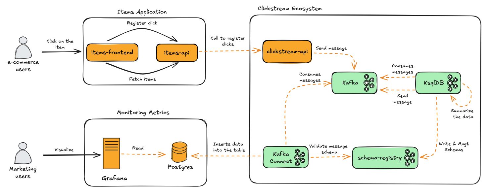
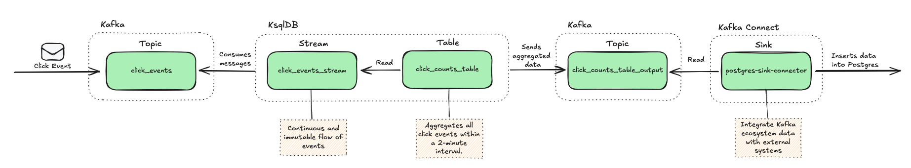

# Solução de Clickstream para E-commerce

## Introdução

Esta é uma solução de **Clickstream** projetada para plataformas de **e-commerce**, permitindo que as empresas acompanhem, analisem e otimizem a interação dos usuários em tempo real.

Os dados de Clickstream consistem em capturar os cliques e interações do usuário com os produtos exibidos no site, oferecendo informações valiosas sobre o comportamento do consumidor. Com a capacidade de processar esses dados em tempo real, essa solução fornece insights imediatos para ações estratégicas em campanhas de publicidade e personalização de experiência.


## Arquitetura


### Descrição da Arquitetura

#### Items Application
- **items-frontend**: Interface usada por usuários de e-commerce para interagir com os itens disponíveis.
- **items-api**: Backend responsável por buscar itens e registrar cliques, chamando a **clickstream-api**.

#### Clickstream Ecosystem
- **clickstream-api**: Envia os eventos de cliques para o **Kafka**.
- **Kafka**:
    - Armazena eventos de cliques no tópico `click_events`.
    - Serve como intermediário para sistemas downstream.
- **KSQLDB**:
    - Consome eventos do Kafka.
    - Agrega dados e publica em um tópico de saída (`click_counts_table_output`).
- **Schema Registry**:
    - Gerencia os esquemas das mensagens trafegadas no Kafka.
    - Garante consistência e validação.
- **Kafka Connect**: Consome dados agregados do Kafka e insere no banco de dados PostgreSQL.

#### Metrics Dashboard
- **Postgres**: Armazena dados agregados para persistência.
- **Grafana**: Lê os dados do PostgreSQL e permite a visualização de métricas em dashboards acessados por usuários de marketing.

#### Monitoring & Management
- **Connect UI**: Interface para gerenciar o Kafka Connect.
- **Registry UI**: Interface para gerenciar esquemas no Schema Registry.


## Inicializando e Configurando a Solução

Siga os passos abaixo para inicializar e configurar a solução de Clickstream:

### Passo 1: Subir os Contêineres com Docker Compose
Acesse o diretório raiz da solução e execute o seguinte comando para construir e iniciar todos os contêineres:

```bash
$ docker-compose up --build
```
### Passo 2: Executar o Script de Configuração
Após o Docker Compose inicializar todos os contêineres, conceda permissão de execução ao script de configuração e execute-o:
```bash
$ chmod +x setup.sh
$ ./setup.sh
```
Este script irá configurar os tópicos Kafka, streams e tabelas necessários para o funcionamento da solução.

### Passo 3: Criando o Data Source no Grafana

Siga os passos abaixo para criar o Data Source no Grafana:

1. **Acesse o Grafana**
  - Link: [http://localhost:3000/](http://localhost:3000/)
  - **Usuário**: `admin`
  - **Senha**: `admin`

2. **Navegue até o menu Data Sources**  
   No menu lateral, vá até **`Connections > Data Sources`**.

3. **Adicionar um novo Data Source**  
   Clique no botão **`Add new data source`** e selecione a opção **`PostgreSQL`**.

4. **Configurar o Data Source**  
   Preencha os campos com as seguintes informações:
  - **Host URL**: `postgres:5432`
  - **Database Name**: `db_metrics`
  - **Username**: `user_metrics`
  - **Password**: `password_metrics`
  - **TLS/SSL Mode**: `Disable`

5. **Salvar e testar a conexão**  
   Após preencher os campos, clique no botão **`Save & Test`**. Se tudo estiver correto, o Data Source será criado com sucesso.

6. **Obter o UID do Data Source**  
   Após a criação, observe a URL no navegador. Ela será algo como:  
   `http://localhost:3000/connections/datasources/edit/ee8bhesmqpczkb`
  - O último conjunto de caracteres (`ee8bhesmqpczkb`) é o **UID do Data Source**.
  - Copie este valor, pois ele será necessário no próximo passo.


### Passo 4: Configurando e Importando o Dashboard
Siga os passos abaixo para configurar e importar o dashboard no Grafana:

1. **Editar o arquivo `dashboard.json`**  
   Localize o arquivo `dashboard.json` na raiz do projeto e substitua o texto `<datasource_uid_grafana>` pelo UID do Data Source criado no passo anterior.

2. **Acessar o menu Dashboards**  
   No menu lateral do Grafana, clique em **`Dashboards`**.

3. **Criar um novo dashboard**
  - Clique no botão **`New`**.
  - Em seguida, selecione a opção **`New dashboard`**.

4. **Importar o dashboard**
  - Clique no botão **`Import dashboard`**.
  - Abra o arquivo `dashboard.json`, copie o conteúdo e cole no campo **`Import via dashboard JSON model`**.

5. **Salvar o dashboard**
  - Por último, clique no botão **`Save`** para finalizar a importação.

## Utilizando a Solução


## Entendendo o Fluxo de Dados


A solução de Clickstream segue o fluxo de dados descrito abaixo, permitindo o processamento e análise em tempo real dos eventos de clique:


### 1. Captura do Evento de Clique
- **Origem**: Um evento de clique, representado por uma mensagem JSON, é gerado por uma aplicação de e-commerce.
- **Destino**: O evento é enviado para o tópico Kafka chamado `click_events`.


### 2. Kafka
- **Papel**: Atua como uma camada intermediária de armazenamento de eventos de clique. O tópico `click_events` recebe todos os eventos gerados pela aplicação de e-commerce.
- **Características**:
   - Os eventos são armazenados de forma distribuída.
   - Podem ser consumidos por diferentes sistemas downstream.


### 3. KsqlDB
#### **Stream (`click_events_stream`)**
- **Descrição**: O `click_events_stream` consome mensagens do tópico `click_events`.
- **Papel**:
   - Representa o fluxo contínuo e imutável dos eventos de clique.
   - Cada evento capturado pelo Kafka é processado pelo KSQLDB para extração de informações relevantes.

#### **Tabela (`click_counts_table`)**
- **Descrição**: A tabela `click_counts_table` agrega os eventos capturados pelo stream em janelas de 2 minutos.
- **Papel**:
   - Realiza a contagem de cliques por campanha (`campaignId`) dentro do intervalo de tempo especificado.
   - Os dados agregados são armazenados de forma estruturada para permitir consultas adicionais.
- **Detalhe Técnico**:
   - Essa tabela publica os dados agregados em um novo tópico Kafka chamado `click_counts_table_output`.

### 4. Kafka (Tópico `click_counts_table_output`)
- **Papel**: Recebe os dados agregados e sumarizados da tabela `click_counts_table`.
- **Formato dos Dados**:
   - **campaignId**: Identificação da campanha.
   - **click_count**: Total de cliques registrados na janela de 2 minutos.
   - **start_time** e **end_time**: Intervalo de tempo da agregação.

### 5. Kafka Connect
#### **Sink (`postgres-sink-connector`)**
- **Papel**:
   - Lê os dados do tópico `click_counts_table_output`.
   - Insere as informações agregadas no banco de dados PostgreSQL.
- **Transformação de Dados**:
   - Os campos de tempo (`start_time` e `end_time`) são convertidos de formato `BIGINT` para `timestamp` antes de serem inseridos no banco de dados.

### 6. PostgreSQL
- **Papel**: Armazena os dados agregados de cliques de forma estruturada e persistente.
- **Benefícios**:
   - Facilita a consulta e análise dos dados agregados.
   - Permite integração com ferramentas de visualização, como Grafana ou Looker, para criação de dashboards em tempo real.

### Resumo do Fluxo
1. Eventos de cliques são capturados e enviados para o Kafka.
2. O KSQLDB processa os eventos em tempo real:
   - Converte o fluxo contínuo (`click_events_stream`) em agregações sumarizadas (`click_counts_table`).
3. Os dados agregados são publicados no tópico Kafka `click_counts_table_output`.
4. O Kafka Connect lê os dados do tópico e insere no PostgreSQL para armazenamento persistente.
5. Ferramentas externas podem acessar o banco de dados para análises e visualizações.


