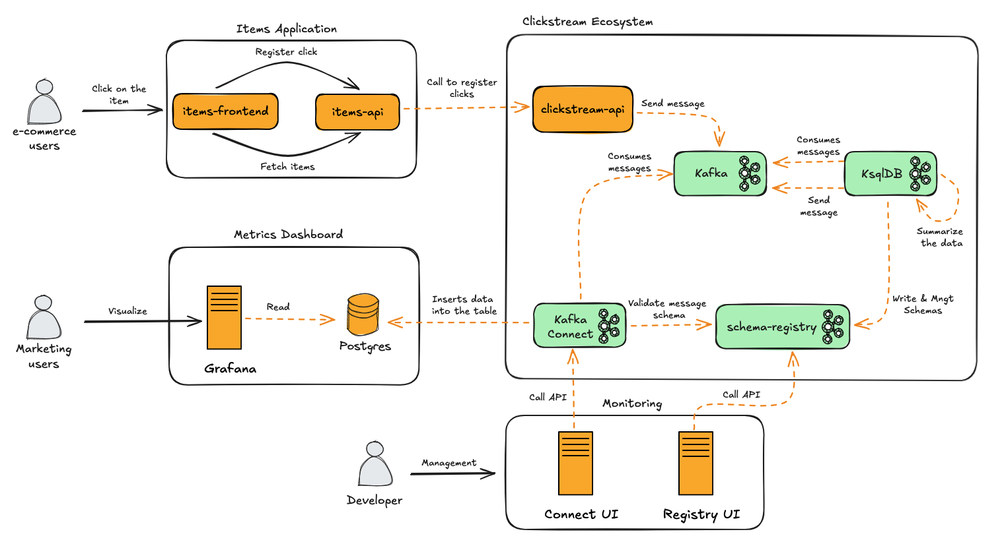

# Solução de Clickstream para E-commerce

## Introdução

Essa solução de Clickstream foi projetada para um sistema de e-commerce fictício, ela permite acompanhar, entender e melhorar como os usuários interagem com seus produtos em tempo real.

Basicamente, ela captura os cliques e as interações dos usuários no site, transformando isso em dados valiosos sobre o comportamento deles. Com tudo processado em tempo real, você consegue ter insights instantâneos para ajustar campanhas de marketing, personalizar a experiência do cliente e tomar decisões estratégicas na hora certa.


## Arquitetura


#### Componentes da Arquitetura

| **Componente**          | **Descrição**                                                                                                      |
|--------------------------|--------------------------------------------------------------------------------------------------------------------|
| items-frontend           | Interface usada por usuários de e-commerce para interagir com os itens disponíveis.                                |
| items-api                | Backend responsável por buscar itens e registrar cliques, chamando a **clickstream-api**.                          |
| clickstream-api          | Envia os eventos de cliques para o **Kafka**.                                                                      |
| Kafka                    | - Armazena eventos de cliques no tópico `click_events`. Serve como intermediário para sistemas downstream.         |
| KSQLDB                   | - Consome eventos do Kafka. Agrega dados e publica em um tópico de saída (`click_counts_table_output`).            |
| Schema Registry          | - Gerencia os esquemas das mensagens trafegadas no Kafka. Garante consistência e validação.                        |
| Kafka Connect            | Consome dados agregados do Kafka e insere no banco de dados PostgreSQL.                                            |
| Postgres                 | Armazena dados agregados para persistência.                                                                        |
| Grafana                  | Lê os dados do PostgreSQL e permite a visualização de métricas em dashboards acessados por usuários de marketing.  |
| Connect UI               | Interface para monitorar o Kafka Connect.                                                                          |
| Registry UI              | Interface para gerenciar esquemas no Schema Registry.                                                              |

<br>

## Inicializando e Configurando a Solução

Siga os passos abaixo para inicializar e configurar a solução de Clickstream:

### Passo 1: Subir os Contêineres com Docker Compose
Acesse o diretório raiz da solução e execute o seguinte comando para construir e iniciar todos os contêineres:

```bash
$ docker-compose up --build
```
### Passo 2: Executar o Script de Configuração
Após o Docker Compose inicializar todos os contêineres, conceda permissão de execução ao script de configuração e execute-o:
```bash
$ chmod +x setup.sh
$ ./setup.sh
```
Este script irá configurar os tópicos Kafka, streams e tabelas necessários para o funcionamento da solução.

### Passo 3: Criando o Data Source no Grafana

Siga os passos abaixo para criar o Data Source no Grafana:

1. **Acesse o Grafana**
  - Link: [http://localhost:3000/](http://localhost:3000/)
  - **Usuário**: `admin`
  - **Senha**: `admin`

2. **Navegue até o menu Data Sources**  
   No menu lateral, vá até **`Connections > Data Sources`**.

3. **Adicionar um novo Data Source**  
   Clique no botão **`Add new data source`** e selecione a opção **`PostgreSQL`**.

4. **Configurar o Data Source**  
   Preencha os campos com as seguintes informações:
  - **Host URL**: `postgres:5432`
  - **Database Name**: `db_metrics`
  - **Username**: `user_metrics`
  - **Password**: `password_metrics`
  - **TLS/SSL Mode**: `Disable`

5. **Salvar e testar a conexão**  
   Após preencher os campos, clique no botão **`Save & Test`**. Se tudo estiver correto, o Data Source será criado com sucesso.

6. **Obter o UID do Data Source**  
   Após a criação, observe a URL no navegador. Ela será algo como:  
   `http://localhost:3000/connections/datasources/edit/ee8bhesmqpczkb`
  - O último conjunto de caracteres (`ee8bhesmqpczkb`) é o **UID do Data Source**.
  - Copie este valor, pois ele será necessário no próximo passo.


### Passo 4: Configurando e Importando o Dashboard
Siga os passos abaixo para configurar e importar o dashboard no Grafana:

1. **Editar o arquivo `dashboard.json`**  
   Localize o arquivo `dashboard.json` na raiz do projeto e substitua o texto `<datasource_uid_grafana>` pelo UID do Data Source criado no passo anterior.

2. **Acessar o menu Dashboards**  
   No menu lateral do Grafana, clique em **`Dashboards`**.

3. **Criar um novo dashboard**
  - Clique no botão **`New`**.
  - Em seguida, selecione a opção **`New dashboard`**.

4. **Importar o dashboard**
  - Clique no botão **`Import dashboard`**.
  - Abra o arquivo `dashboard.json`, copie o conteúdo e cole no campo **`Import via dashboard JSON model`**.

5. **Salvar o dashboard**
  - Por último, clique no botão **`Save`** para finalizar a importação.

<br>

## Utilizando a Solução
> **Nota:** Para acessar os recursos da solução, é necessário que todas as configurações tenham sido realizadas com sucesso.

1. **Acessando a aplicação web**
 - Acesse a aplicação por meio desse link http://localhost:8080/


 - Para simular os eventos de cliques experimente clicar nos botões **`Click Me`** de cada item.
   

2. **Visualizando os Dados**
 - Os dados em tempo real dos cliques podem ser visualizados no Dashboard no Grafana. Para isso acesse o dashboard no Grafana.


3. **Simulando Cliques**
 - No diretório raiz do projeto há um script para simular cliques. Execute o comando abaixo:
```bash
$ chmod +x simulate_click.sh
$ ./simulate_click.sh
```

<br>

## Entendendo o Fluxo de Dados


O fluxo dos dados funciona de forma simples. Toda vez que alguém clica em um item no site, um evento em formato JSON é gerado e enviado para o Kafka, que armazena esses eventos de forma organizada, pronta para ser consumida por outros sistemas.

O KSQLDB entra em ação consumindo esses eventos e processando as informações. Ele cria um fluxo contínuo (stream) que processa os cliques em tempo real e, em seguida, organiza esses cliques em uma tabela que conta o número de cliques por campanha a cada 2 minutos. Esses dados agregados são então enviados para um novo tópico no Kafka.

Posteriormente, o Kafka Connect lê os dados do tópico de agregação e insere no banco de dados PostgreSQL. Durante essa etapa, são aplicadas transformações nos dados, como a conversão dos campos de tempo (`start_time` e `end_time`) para o formato de timestamp.

Por fim, o PostgreSQL armazena os dados de forma estruturada e organizada. Esses dados podem ser acessados por ferramentas como Grafana ou Looker, que possibilitam a criação de dashboards atrativos e úteis para análises em tempo real.

<br>

## Dados no Postgres
> **Nota:** A tabela é criada automaticamente pelo Kafka Connect. Portanto, para que você possa acessá-la é necessários que todas as configurações tenham sido realizadas com sucesso. 

A imagem abaixo mostra como os dados são armazenados e organizados depois de persistidos no Postgres.


<br>

## Outros Recursos
> **Nota:** Para acessar esses recursos é necessário que todas as configurações tenham sido realizadas com sucesso.

1. Gerenciamento do conectores do Kafka Connect
 -  **Kafka Connect UI**: http://localhost:8084 
2. Gerenciamento do esquemas das mensagens no Schema Registry
-  **Schema Registry UI**: http://localhost:8086